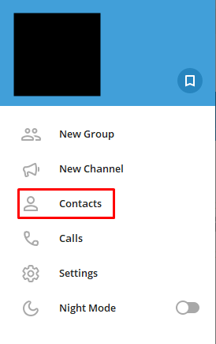
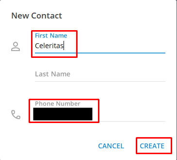
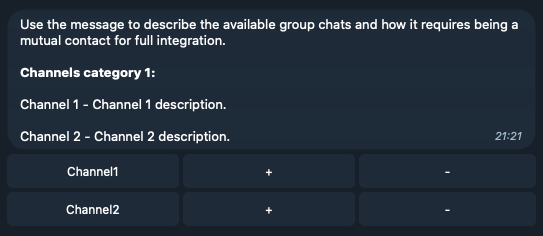

# Celeritas

Telegram Channel Travel aka Celeritas is a Telegram bot for small communities with multiple group chats. The bot allows users to join and leave selected channels at will.

The process saves moderators/admins a lot of time and helps to connect many group chats to one network.

## How it works

The bot uses MTProto API ([Telethon](https://github.com/LonamiWebs/Telethon)) to invite users to groups. Standard bots created with BotFather don't have an option to invite users to group chats for safety reasons.

The bot created with BotFather is responsible for kicking users from group chats.

## Requirements

- Telegram account with generated ID and Hash ([setup details](https://core.telegram.org/api/obtaining_api_id)).

I strongly recommend you buy a second phone card and set up a new Telegram account dedicated to this bot. Telegram has some spam prevention systems that may flag your automated account as a spambot and ban it permanently. When you write to support, they lift the ban, but it may take days or even weeks.

- Telegram Bot Token (generated through BotFather).

## Configuration

The section describes a minimal setup for group chats and each user. Start the process with running `make setup`. This will generate the example configs in `config/files/*` and create `.env` file for development. In production, I recommend using CI/CD to inject the environment variables.

- Group Chats

File: `config/files/channels.json`

Fill the config with channel names and IDs. You can find the ID using Telegram Web client and prepending -100 to the number between's` and `_`:

- Whitelist

File: `config/files/whitelist.json`

You need to add users to the whitelist to allow them to use the bot. You can find their IDs by using the script in `scripts/map_chat_members_ids.py`. It asks for a group chat id that both the user and your MTProto account are in.

You can find the group chat id the same way as in the previous section.

- Message

File: `config/files/message.txt`

The message for short description of the channels. It uses [Markdown](https://core.telegram.org/bots/api#markdown-style) style.

- Mutual contacts

When users leave group chat once they can be added back only by a mutual contact, it means that both your MTProto account and a user account need to have each other's phone numbers in contacts.

There is a script for automating the process from your side: `scripts/telegram_api_add_contact.py`.
It asks for a phone number, a name for the contact and adds the user to your account.

The users must do the following process on their side:

You must provide them with your MTProto account phone number.

- Group chat members & permissions

Both the MTProto account and Telegram Bot need to be added to all configured channels, and they both need to have administrator privileges.

- i18n

The bot is not designed with i18n in mind. You might want to change some messages in: `mods/channel_travel.py`.
For now, there is only one that informs about the lack of permissions.

## Installation & Telegram Session

The bot is fully dockerized. You need to provide the container with configuration files (e.g. by mounting them as volumes) and environment variables.
I recommend not to keep the files in the image itself, especially if you use public Docker Hub.

The bot will need a Telegram API session file to connect to the API. You can generate one in development by running the bot for the first time (with correct Telegram API ID and Hash). You will be prompted for a phone number and an authentication code that's going to be sent to your new account as a private message. After the session file is created, you can mount it the same way as you do with the configuration files.

The session file name is configured by `TELEGRAM_API_SESSION_NAME` env variable.

## Usage

The bot uses a single command to show a dashboard tha contains a message from `config/files/message.txt` and rows of channels from `config/files/channels.json`. The default command is `/channels`. Users can click `+` and `-` buttons to join or leave channels.

## Contributing
Pull requests are welcome. For major changes, please open an issue first to discuss what you would like to change.

## License
[MIT](https://choosealicense.com/licenses/mit/)